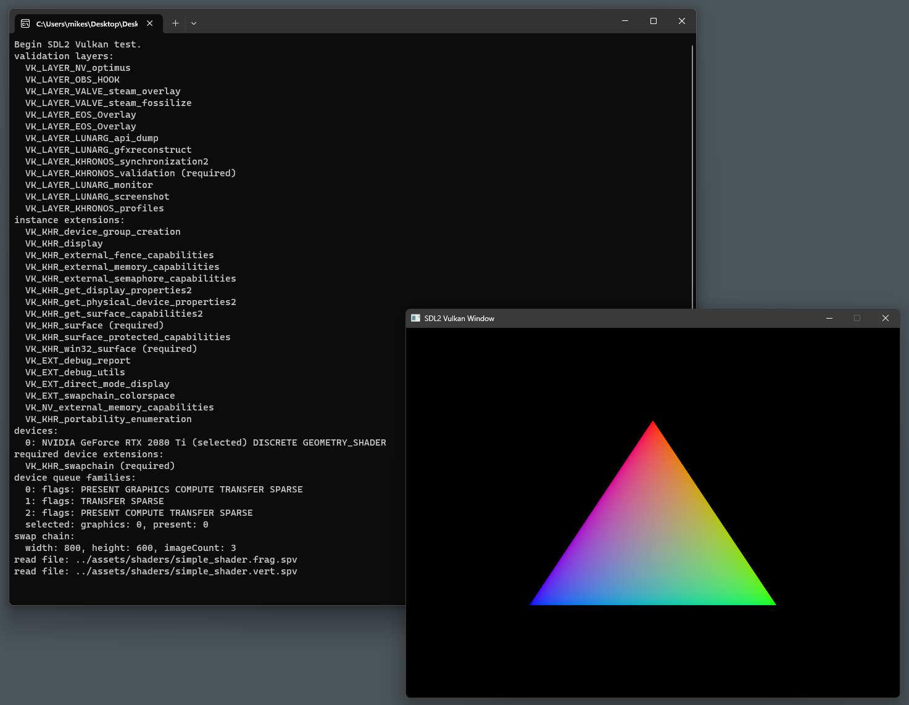

# Vulkan Game

## Prerequisites
- Vulkan SDK (not-included)  
  https://www.lunarg.com/vulkan-sdk/
- SDL (included)
- GLM (included)
- Clang (recommended)

## Building
1. Start > Run... > "cmd.exe"
2. Build with Node.js script (uses `clang++`)
   ```
   node build_scripts/Makefile.mjs Pong_test
   ```

## Debugging
- Can use VSCode (see `.vscode/tasks.json`), or;
- Can debug with `gdb`

## Collaborate

- Discord: Vulkan Game Engine Dev  
  https://discord.gg/2XuShqjC
- Discord: Global Game Jam (Jan - Feb)  
  https://discord.gg/ggj

## Screenshot


## Video
[](docs/video/2024-02-25_Pong_test.mp4)


## Test files:
- [tests/lib/](tests/lib/)

## References

Beginner:
- My notes on C++  
  https://github.com/mikesmullin/cpp11-14-17-examples/blob/master/README.md
- Vulkan (C++) Game Engine Tutorial  
  https://www.youtube.com/watch?v=Y9U9IE0gVHA&list=PL8327DO66nu9qYVKLDmdLW_84-yE4auCR
- Brendan's Vulkan Game Engine  
  https://github.com/blurrypiano/littleVulkanEngine
- Official Vulkan Tutorial  
  https://vulkan-tutorial.com/Introduction  
  https://github.com/Overv/VulkanTutorial/tree/main/code
- Official Vulkan Sample Code  
  https://github.com/KhronosGroup/Vulkan-Samples
- Vulkan API Discussion  
  https://www.youtube.com/watch?v=gZ9lSzI_Geg&list=PLNhdAzzsGnqPLeu7Doln4cFrpq-P_ZKsh
- Custom cross-platform C std lib | YouTube Mr. 4th Programming  
  https://youtube.com/playlist?list=PLT6InxK-XQvNKTyLXk6H6KKy12UYS_KDL

Intermediate:
- Vulkan Guide: GPU Driven Rendering Overview  
  https://vkguide.dev/docs/gpudriven/gpu_driven_engines/
- Vulkan API Demos  
  https://github.com/SaschaWillems/Vulkan/tree/master
- Vulkan API diagrams  
  https://github.com/David-DiGioia/vulkan-diagrams

Advanced:
- Debugging in RenderDoc + nVidia nSight Graphics  
  https://www.saschawillems.de/blog/2016/05/28/tutorial-on-using-vulkans-vk_ext_debug_marker-with-renderdoc/
- Mastering Graphics Programming with Vulkan  
  https://www.amazon.com/dp/B0BKGLBN89
- Vulkan Memory Management  
  https://www.youtube.com/watch?v=gM93bbKQ0P8  
  https://developer.nvidia.com/vulkan-memory-management#
- Optimizing Texture Transfers | nVidia GPU Tech Conf  
  https://on-demand.gputechconf.com/gtc/2012/presentations/S0356-GTC2012-Texture-Transfers.pdf
- GPU Framebuffer Memory: Understanding Tiling | Samsung Developers  
  https://developer.samsung.com/galaxy-gamedev/resources/articles/gpu-framebuffer.html
- EASTL | Electronic Arts Standard Template Library  
  https://github.com/electronicarts/EASTL
- Forward vs. Deferred Rendering  
  https://www.youtube.com/watch?v=n5OiqJP2f7w
- How Roblox uses Vulkan  
  https://www.youtube.com/watch?v=1z7sM8D5xj0
- How Supercell uses Vulkan  
  https://www.youtube.com/watch?v=Fwh-fzhREOU

## Dependencies
- Lua  
  https://www.lua.org/  
  tutorial: https://www.youtube.com/watch?v=4l5HdmPoynw
- Google Protobuf  
  https://github.com/protocolbuffers/protobuf/releases
  - installed with vcpkg https://vcpkg.io/en/getting-started
  ```
  C:\> vcpkg install protobuf protobuf:x64-windows
  ```
  - legend for file extensions:
    - `.proto`: schema (proto3) language-agnostic input code
    - `.pb.{h,cc}`: schema output cpp implementation code
    - `.pb`: json-like protobuf text-based input format (human-readable data)
    - `.bin`: encoded protobuf binary output format (machine-readable data)

## TODO

- publish to mobile