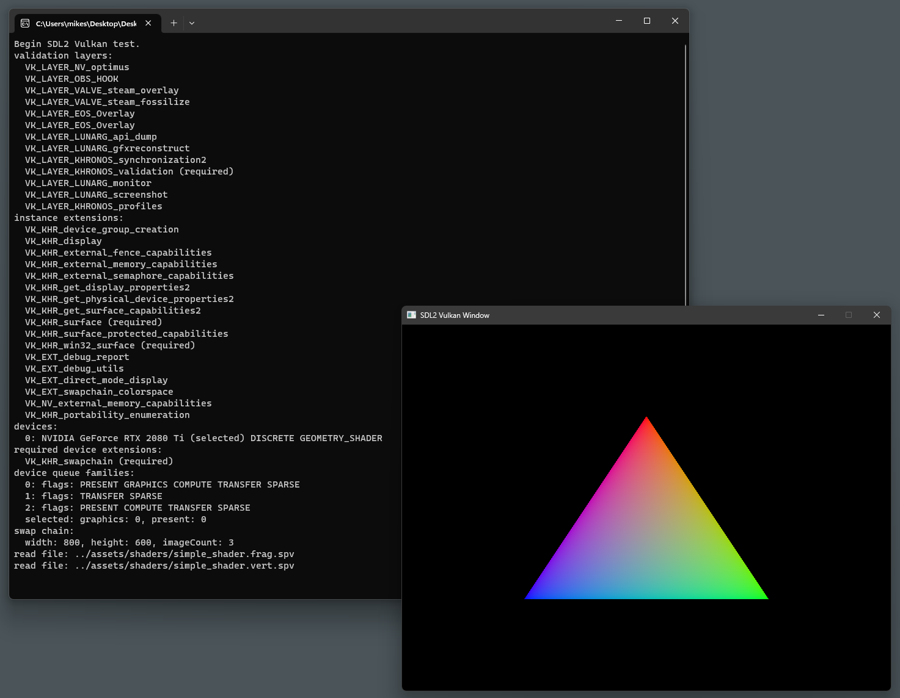

# Untitled Game

Currently working on the foundations for a custom game engine.

## Prerequisites
- Vulkan SDK 64-bit (not included)  
  https://www.lunarg.com/vulkan-sdk/

## Building
1. Start > Run... > "x64 Native Tools Command Prompt for VS 2022"
2. Build with Makefile
   ```
   nmake vulkan_test
   ```

## Debugging
1. Start > Run... > "x64 Native Tools Command Prompt for VS 2022"
2. Open in VSCode
   ```
   code .
   ```
4. Debug from within VSCode buttons (ie. `.vscode/tasks.json`)

## Collaborate
- Discord: Vulkan Game Engine Dev  
  https://discord.gg/2XuShqjC

## Screenshot
