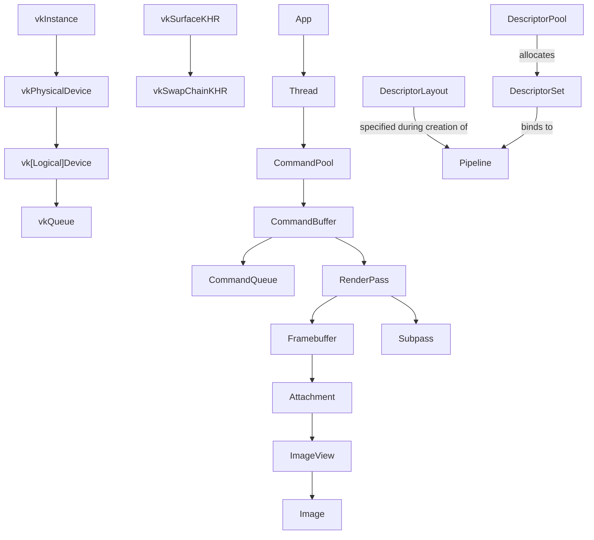
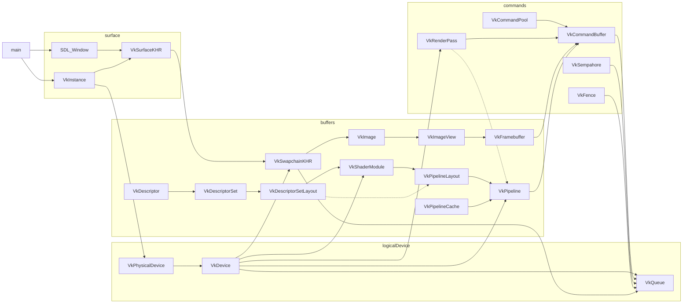
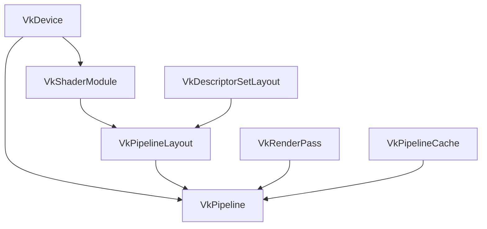

```mermaid
graph TD
  vkInstance --> vkPhysicalDevice
  vkPhysicalDevice --> vkDevice["vk[Logical]Device"] --> vkQueue
  
  vkSurfaceKHR --> vkSwapChainKHR

  App --> Thread -->CommandPool
  CommandPool --> CommandBuffer
  CommandBuffer --> CommandQueue
  RenderPass --> Framebuffer
  RenderPass --> Subpass
  Attachment --> ImageView
  Framebuffer --> Attachment
  ImageView --> Image
  CommandBuffer --> RenderPass

  DescriptorLayout -->|specified during creation of| Pipeline
  DescriptorPool -->|allocates| DescriptorSet
  DescriptorSet -->|binds to| Pipeline
```

```mermaid
graph LR

%% This is a graph of the init order,
%% based solely on input dependencies,
%% to see what can be initialized in parallel.

subgraph surface
  SDL_Window
  VkInstance  
  VkSurfaceKHR
end

subgraph logicalDevice
  VkPhysicalDevice
  VkDevice
  VkQueue
end

subgraph buffers
  VkSwapchainKHR
  VkImage
  VkDescriptor
  VkShaderModule
  %%subgraph views
    VkDescriptorSetLayout
    VkPipelineLayout
    VkImageView
    VkDescriptorSet
    VkPipeline
    VkPipelineCache
  %%end
  VkFramebuffer  
end

subgraph commands
  VkRenderPass
  VkShaderModule
  VkCommandPool
  VkCommandBuffer
  VkSempahore
  VkFence
end

main --> SDL_Window & VkInstance
VkInstance -->
VkPhysicalDevice
VkSurfaceKHR
SDL_Window & VkInstance --> VkSurfaceKHR

VkPhysicalDevice --> VkDevice --> VkQueue

VkDevice & VkSurfaceKHR --> VkSwapchainKHR -->
VkImage -->
VkImageView

VkDevice --> VkRenderPass
%%VkDevice --> VkDescriptorSetLayout
%%VkDevice --> VkShaderModule
%%VkDevice --> VkPipelineLayout
%%VkDevice & VkPipelineLayout --> VkPipeline
VkDescriptor --> VkDescriptorSet --> VkDescriptorSetLayout --> VkShaderModule

VkDevice --> VkShaderModule
VkShaderModule --> VkPipelineLayout
VkDescriptorSetLayout -.-> VkPipelineLayout
VkDevice & VkPipelineLayout & VkPipelineCache --> VkPipeline
VkRenderPass -.-> VkPipeline

VkCommandPool --> VkCommandBuffer
VkCommandBuffer & VkSempahore & VkFence & VkSwapchainKHR --> VkQueue


VkImageView --> VkFramebuffer
VkRenderPass & VkFramebuffer & VkPipeline --> VkCommandBuffer
```

```mermaid
graph TD

VkDevice --> VkShaderModule
VkShaderModule & VkDescriptorSetLayout --> VkPipelineLayout

VkDevice & VkPipelineLayout & VkRenderPass & VkPipelineCache --> VkPipeline
```