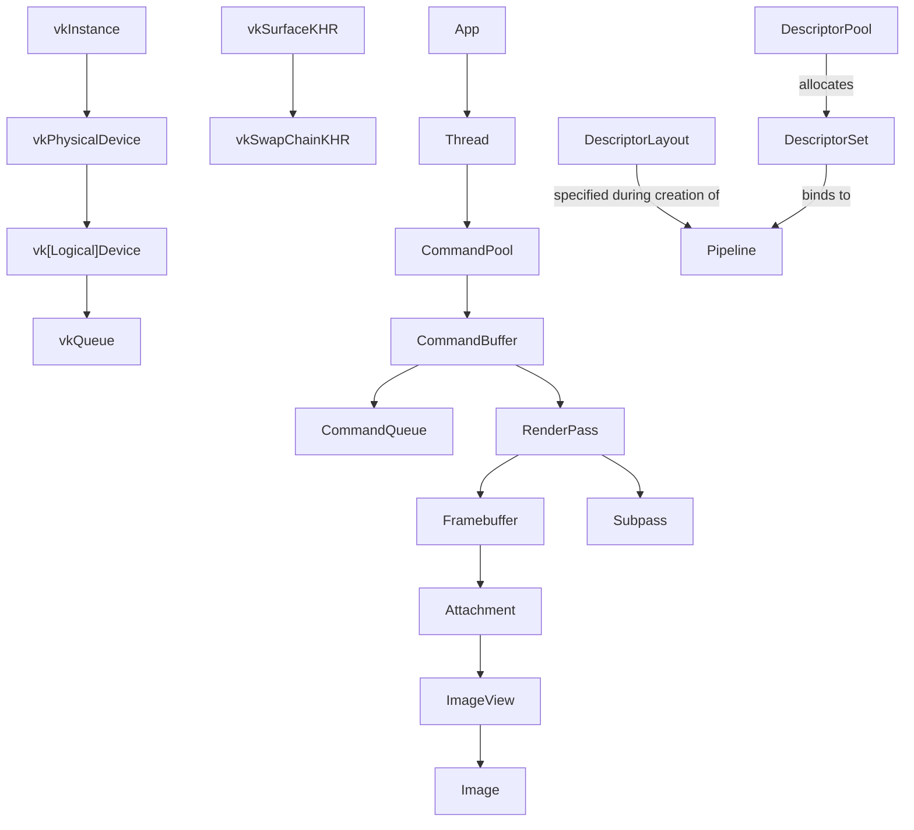

```mermaid
graph TD
  vkInstance --> vkPhysicalDevice
  vkPhysicalDevice --> vkDevice["vk[Logical]Device"] --> vkQueue
  
  vkSurfaceKHR --> vkSwapChainKHR

  App --> Thread -->CommandPool
  CommandPool --> CommandBuffer
  CommandBuffer --> CommandQueue
  RenderPass --> Framebuffer
  RenderPass --> Subpass
  Attachment --> ImageView
  Framebuffer --> Attachment
  ImageView --> Image
  CommandBuffer --> RenderPass

  DescriptorLayout -->|specified during creation of| Pipeline
  DescriptorPool -->|allocates| DescriptorSet
  DescriptorSet -->|binds to| Pipeline
```
